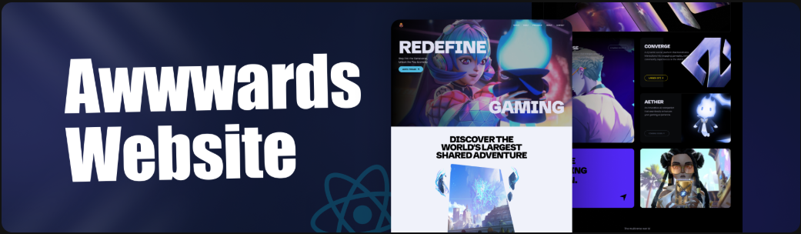

#

                                        

  
  
  

# 🤖 Introduction

Build a visually captivating website inspired by Zentry, featuring scroll-triggered animations, geometric transitions, and engaging video storytelling. Learn how to deliver a luxurious, modern feel, focusing on engaging UI/UX and smooth responsiveness, capturing the essence of what makes an Awwwards winner.

# ⚙️ Tech Stack

<li>HTML / CSS</li>
<li>JavaScript</li>
<li>React.js</li>
<li>GSAP Animated Library</li>
<li>TailwindCSS</li>

# 🔋 Features

👉 Scroll-Based Animations: Dynamic animations triggered by scrolling for a more engaging user experience.

👉 Clip Path Shaped Animations: Unique geometric transitions using CSS clip-paths to create visually stunning effects.

👉 3D Hover Effects: Interactive 3D transformations that respond to user interactions for a modern feel.

👉 Video Transitions: Seamlessly integrated video elements to enhance storytelling and flow.

👉 Smooth UI/UX: Polished interfaces with buttery-smooth interactions for an intuitive user journey.

👉 Completely Responsive: Flawless adaptation across all devices, ensuring a consistent experience.

and many more, including code architecture and reusability

# 🤸 Quick Start

Follow these steps to set up the project locally on your machine.

Prerequisites

Make sure you have the following installed on your machine:

<li>Git</li>
<li>npm </li>

Cloning the Repository

  <pre>
    git clone https://github.com/adrianhajdin/award-winning-website.git
    cd award-winning-website
  </pre>

